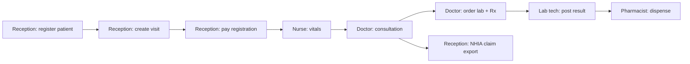

# Modern EMR — Manual Testing Guide

Use this guide to walk through the app role-by-role on a local or staging environment. Every clinical action is **visit-scoped**: you need a patient, an open visit, and (for most clinical work) **payment cleared**.

---

## 1. Before you start

### Start the stack

```powershell
# One-time setup (Windows)
.\scripts\setup-backend-venv.ps1
.\scripts\prepare-local.ps1 -UseSqlite -ResetDb

# Terminal 1 — API
.\scripts\start-local-backend.ps1 -UseSqlite

# Terminal 2 — UI
cd frontend
npm install
npm start
```

Open **http://localhost:3000** (frontend) and confirm the API at **http://localhost:8000/api/v1/health/**.

### Seed test accounts

`prepare-local.ps1` runs `seed_e2e_users`, which creates:

| Role | Email | Password |
|------|-------|----------|
| Doctor | doctor@clinic.com | Doctor123! |
| Receptionist | receptionist@clinic.com | Receptionist123! |
| Lab technician | labtech@clinic.com | LabTech123! |
| Pharmacist | pharmacist@clinic.com | Pharmacist123! |
| Patient (portal) | patient@clinic.com | Patient123! |

**Not seeded by default:** Nurse, Radiology technician, Admin. Create them once:

```powershell
cd backend
.\.venv\Scripts\python.exe manage.py shell
```

```python
from apps.users.models import User
from apps.organizations.models import Organization, OrganizationUser

org = Organization.objects.filter(slug="default-clinic").first()
for email, role, pwd, name in [
    ("nurse@clinic.com", "NURSE", "Nurse123!", "Test Nurse"),
    ("radiology@clinic.com", "RADIOLOGY_TECH", "RadTech123!", "Test Rad Tech"),
    ("admin@clinic.com", "ADMIN", "Admin123!", "Test Admin"),
]:
    u, _ = User.objects.get_or_create(username=email, defaults={"email": email, "role": role, "first_name": name.split()[0], "last_name": name.split()[1]})
    u.role = role
    u.set_password(pwd)
    u.is_active = True
    u.save()
    OrganizationUser.objects.update_or_create(organization=org, user=u, defaults={"role": "MEMBER", "is_default": True})
```

Or use Django admin: **http://localhost:8000/admin/** (create a superuser with `create_superuser.py` first).

### Core rules to remember

| Rule | What it means when testing |
|------|----------------------------|
| **Visit-scoped** | Labs, prescriptions, nursing, consultation — all tied to `/visits/{id}/…` |
| **Registration fee gate** | Doctor consultation workspace stays locked until **registration/intake** is paid on the visit |
| **Payment cleared** | Nurse vitals, lab posting, dispensing usually require visit payment **PAID**, **SETTLED**, or **PARTIALLY_PAID** |
| **Consultation first** | Doctor orders (labs, radiology, prescriptions) need a **consultation** record on the visit |
| **403 / payment errors** | Expected if you skip reception billing — go to Visit Details → Billing first |

---

## 2. Recommended end-to-end test (all roles)

Use this sequence once to validate the full clinic day:



### Step-by-step

1. **Receptionist** — Register patient → `/patients/register`
2. **Receptionist** — Create visit → `/visits/new` (pick patient, CASH or INSURANCE)
3. **Receptionist** — Open visit → `/visits/{id}` → **Billing** section → record payment (Cash/POS/Transfer) until registration gate clears
4. **Nurse** — `/visits/{id}/nursing` → record vitals, nursing notes
5. **Doctor** — `/visits/{id}/consultation` → chart (history, exam, diagnosis) → save
6. **Doctor** — Same screen: Service catalog, Lab orders, Prescriptions, AI Scribe (optional)
7. **Lab tech** — `/lab-orders` → select visit → enter result → check **Clinical Alerts** if critical
8. **Pharmacist** — `/prescriptions` → select visit → enter dispensed quantity → **Dispense**
9. **Receptionist / Admin** — Visit Details → **NHIA Claim** panel → validate → download CSV → record manual submission

---

## 3. Role-by-role navigation

### Receptionist

**Dashboard:** `/dashboard` — stats, quick actions

| Task | Path | What to verify |
|------|------|----------------|
| Register patient | `/patients/register` | Demographics, NHID field, emergency contact |
| Search / edit patients | `/patients` | Structured allergies panel, legacy summary |
| Verify NHID | `/patients/verification` | Stub mode accepts valid-format IDs locally |
| Create visit | `/visits/new` | Requires patient; offline queues `CHECK_IN_VISIT` |
| List visits | `/visits` | Filter OPEN / payment status |
| Visit details & billing | `/visits/{id}` | Charges, Paystack, wallet, invoice/receipt |
| Pending billing queue | `/billing/pending-queue` | Unpaid line items across visits |
| Deferred payments | `/billing/deferred-payments` | Payment plans / deferrals |
| Appointments | `/appointments` | Schedule, link to visit |
| Wallet (clinic) | `/wallet` | Top-up / clinic wallet flows |
| Payment reconciliation | `/billing/payment-reconciliation` | Match payments to visits |
| Offline sync | `/offline/queue` | After registering offline, sync when online |
| NHIA claims list | `/billing/claims` | Cross-visit claim submissions |

**Receptionist cannot:** open consultation chart, admission clinical notes (by design).

**Manual test checklist — Receptionist**

- [ ] Register new patient with allergies (structured + summary sync)
- [ ] Create visit for that patient
- [ ] Pay registration fee on Visit Details
- [ ] Confirm doctor can open consultation after payment
- [ ] Export visit summary (Print / Text / HTML on Visit Details)
- [ ] Queue patient registration while offline → sync on `/offline/queue`

---

### Doctor

**Dashboard:** `/dashboard` — open visits, telemedicine, antenatal links

| Task | Path | What to verify |
|------|------|----------------|
| Consultation workspace | `/visits/{id}/consultation` | Single scrollable screen: header, allergies banner, alerts, vitals, form, orders |
| Visit details (read-only context) | `/visits/{id}` | Timeline, billing summary, NHIA panel |
| Telemedicine hub | `/telemedicine` | Create session (paid visit), SMS invite |
| Telemedicine room | `/telemedicine/room/{sessionId}` | Video room (Twilio when configured) |
| Lab catalog | `/lab-test-catalog` | Reference tests |
| Radiology study types | `/radiology-study-types` | Catalog management |
| Antenatal | `/antenatal`, `/antenatal/records/new` | ANC records |
| Immunizations | `/clinical/immunizations` | Immunization registry |
| IVF (if enabled) | `/ivf/*` | Cycles, stimulation, medications |

**Consultation workspace sections (top → bottom)**

1. **Patient allergy banner** + **Clinical alerts**
2. **Vital signs** (read/record)
3. **Consultation form** — history, examination, diagnosis, notes
4. **Service catalog** — billable services / NHIA-linked charges
5. **Lab inline** — order tests
6. **Radiology inline** — order imaging
7. **Prescriptions inline** — create Rx (triggers CDS alerts)
8. **Visit charges** (read-only summary)
9. **Referrals, documents, AI scribe, diagnosis codes**
10. **Save / close visit** (bottom actions)

**Manual test checklist — Doctor**

- [ ] Open consultation only after registration paid
- [ ] Create prescription → see allergy / interaction alerts
- [ ] Order CBC from service catalog or lab inline
- [ ] Use **Clinical AI Scribe** → Apply to consultation
- [ ] Add NHIA-coded charge via scribe or service catalog
- [ ] Close visit when billing complete

**Sandbox (safe practice):** Click the **Guide orb** (bottom-right) → **Practice in sandbox** → creates a demo visit with no real PHI. Use for exploring UI without affecting production data.

---

### Nurse

**Dashboard:** `/dashboard` — nursing visit search

| Task | Path | What to verify |
|------|------|----------------|
| Nursing visit page | `/visits/{id}/nursing` | Vitals, nursing notes, med admin, lab sample collection, patient education |
| Admission info | Same page | Admission section when applicable |
| Inpatients list | `/inpatients` | Ward / inpatient context |

**Manual test checklist — Nurse**

- [ ] Allergy banner visible at top of nursing page
- [ ] Record vitals on **paid, OPEN** visit
- [ ] See warning banner if payment not cleared
- [ ] Vitals offline → sync via offline queue
- [ ] Cannot edit doctor diagnosis (read-only where enforced)

---

### Lab technician

**Dashboard:** `/dashboard` → Lab quick action

| Task | Path | What to verify |
|------|------|----------------|
| Lab worklist | `/lab-orders` | Visits with pending lab orders |
| Post results | Select visit → enter result text + abnormal flag | Critical values → clinical alerts |
| Lab catalog | `/lab-test-catalog` | Templates (CBC, LFT, etc. seeded) |

**Manual test checklist — Lab tech**

- [ ] Select visit from worklist
- [ ] Allergy banner + clinical alerts visible
- [ ] Post result with **CRITICAL** flag → doctor sees alert on consultation refresh
- [ ] Cannot access consultation chart

---

### Radiology technician

**Dashboard:** `/dashboard` → Radiology quick action

| Task | Path | What to verify |
|------|------|----------------|
| Radiology worklist | `/radiology-orders` | Pending imaging orders |
| Upload / PACS | Order workflow + `/radiology/upload-status` | Offline DICOM sync status |
| Study types catalog | `/radiology-study-types` | Manage study types |

**Manual test checklist — Radiology tech**

- [ ] Open pending order from worklist
- [ ] Upload metadata / images (if Orthanc stack running — see `docs/DEPLOY.md` imaging section)
- [ ] Report posting and critical flags

*Requires `radiology@clinic.com` user (see §1).*

---

### Pharmacist

**Dashboard:** `/dashboard` → Prescriptions / Drugs

| Task | Path | What to verify |
|------|------|----------------|
| Prescription worklist | `/prescriptions` | Visits with pending Rx |
| Dispense | Select visit → quantity + notes → **Dispense** | CDS alerts on dispense |
| Drug catalog | `/drugs` | Add/edit drugs, inventory link |
| NAFDAC formulary | `/pharmacy/nafdac-formulary` | National formulary reference |

**Manual test checklist — Pharmacist**

- [ ] Allergy banner on selected visit
- [ ] Dispense blocked until exact quantity entered
- [ ] Clinical alerts refresh after dispense
- [ ] Cannot create prescriptions (doctor only)

---

### Admin

Admin users see **all dashboard cards** plus:

| Area | Path |
|------|------|
| Staff approval | `/staff-approval` |
| Audit logs | `/audit-logs` |
| System health | `/health` |
| Reports | `/reports` |
| Backups | `/backups` |
| Service catalog admin | `/service-catalog` |
| Revenue leaks | `/billing/revenue-leaks` |
| NHIA compliance dashboard | `/billing/nhia-compliance` |
| Integration hubs | `/admin/integrations` |
| Organization settings | `/organization/settings` |

**NHIA manual workflow (Admin / billing staff)**

NHIA has **no public API**. Test locally:

1. Visit Details → **NHIA Claim** panel
2. **Validate** → fix any NHID / line errors
3. **Download claim pack (for NHIA portal)**
4. **Mark pack exported** → **Record manual portal submission**
5. After checking real portal (production): **Mark paid** or **Mark denied**

---

### Patient (portal)

Login redirects to `/patient-portal/dashboard`.

| Task | Path |
|------|------|
| Dashboard | `/patient-portal/dashboard` |
| My visits | `/patient-portal/visits` |
| Appointments | `/patient-portal/appointments` |
| Lab results | `/patient-portal/lab-results` |
| Prescriptions | `/patient-portal/prescriptions` |
| Medical history | `/patient-portal/medical-history` |
| Pay bills (Paystack) | Dashboard outstanding bills |
| Telemedicine | `/patient-portal/telemedicine` |

**Manual test checklist — Patient**

- [ ] See structured allergies on dashboard / medical history
- [ ] View lab results and prescriptions after clinician completes workflow
- [ ] Pay outstanding visit balance (Paystack test keys in `.env`)

---

## 4. Interactive Guide (all staff roles)

Available on most pages:

- **Guide orb** — bottom-right; opens help drawer
- **Ctrl+K** — command palette (navigate, sandbox, macros)
- **Role Launch tour** — first-login walkthrough per role
- **Workflow rail** — visit-scoped checklist on consultation / nursing / lab / pharmacy pages
- **JIT hints** — e.g. payment not cleared before closing visit

**Try:** Log in as doctor → Guide orb → **Practice in sandbox** → complete Role Launch steps without touching real patients.

---

## 5. Specialty modules (optional)

| Module | Who | Entry |
|--------|-----|-------|
| **Antenatal** | Doctor, Nurse | `/antenatal` |
| **IVF** | IVF specialist, Embryologist, Doctor | `/ivf` |
| **Telemedicine** | Doctor, Patient | `/telemedicine` |
| **Immunizations** | Staff | `/clinical/immunizations` |

Enable/disable modules per org in **Organization settings** → Guide modules.

---

## 6. Quick URL reference

| URL | Roles |
|-----|-------|
| `/login` | All |
| `/dashboard` | All staff |
| `/patients/register` | Receptionist, Admin |
| `/patients` | Staff |
| `/visits/new` | Receptionist, Admin |
| `/visits` | Staff |
| `/visits/{id}` | Staff |
| `/visits/{id}/consultation` | Doctor |
| `/visits/{id}/nursing` | Nurse |
| `/lab-orders` | Lab tech, Admin |
| `/radiology-orders` | Radiology tech |
| `/prescriptions` | Pharmacist |
| `/drugs` | Pharmacist |
| `/billing/pending-queue` | Receptionist |
| `/billing/nhia-compliance` | Admin |
| `/offline/queue` | Staff |
| `/patient-portal/dashboard` | Patient |

---

## 7. Troubleshooting manual tests

| Symptom | Likely cause | Fix |
|---------|--------------|-----|
| 504 on login | Backend not running | Start `runserver` / `start-local-backend.ps1` |
| 403 payment must be cleared | Registration/consultation not paid | Receptionist → Visit Details → Billing |
| Consultation page empty / locked | `registration_paid` false | Pay intake/registration charge first |
| 404 on insurance endpoint | No insurance record for visit | Normal — optional HMO flow |
| NHIA validate fails | Missing NHID or no billable lines | Set patient NHID + add NHIA charges (scribe/catalog) |
| No lab orders in worklist | Doctor hasn't ordered labs on visit | Complete consultation → order CBC |
| Dispense button locked | Explainable lock (payment/rules) | Read lock message; clear payment |
| Nurse/Radiology login missing | Not in seed | Create users (§1) |

---

## 8. Suggested regression passes

**Daily smoke (15 min)**  
Reception: register → visit → pay → Doctor: brief consultation → Pharmacist: one dispense.

**Weekly deep (1–2 hr)**  
Full §2 flow + NHIA claim export + patient portal + one critical lab alert + offline queue sync.

**Pre-deploy**  
Follow `docs/DEPLOY.md` staging checklist (telemedicine, NHIA panel, migrated visit pagination).

---

## 9. Keyboard shortcuts

| Shortcut | Action |
|----------|--------|
| Ctrl+K | Command palette |
| Guide orb click | Help + sandbox |

---

*Last updated for Modern EMR v2.x — Lifeway single-clinic configuration.*

---

## Related documents

| Document | Use when |
|----------|----------|
| [MANUAL_TEST_ONE_PAGE.md](./MANUAL_TEST_ONE_PAGE.md) | Printable single-page checklist for a test session |
| [MANUAL_TEST_ROLE_SCRIPTS.md](./MANUAL_TEST_ROLE_SCRIPTS.md) | Detailed step-by-step scripts per role (A–I) |
